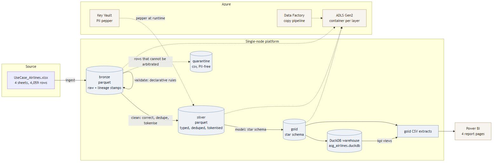
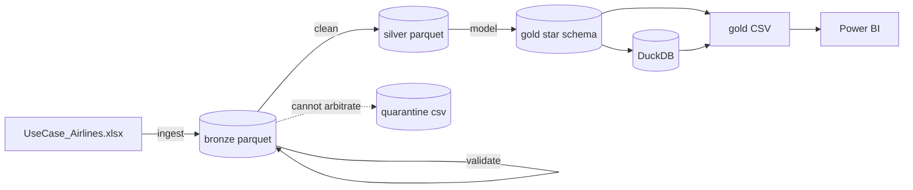
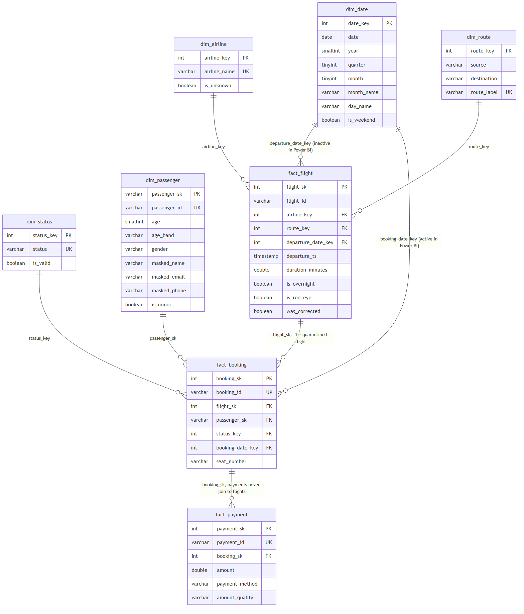
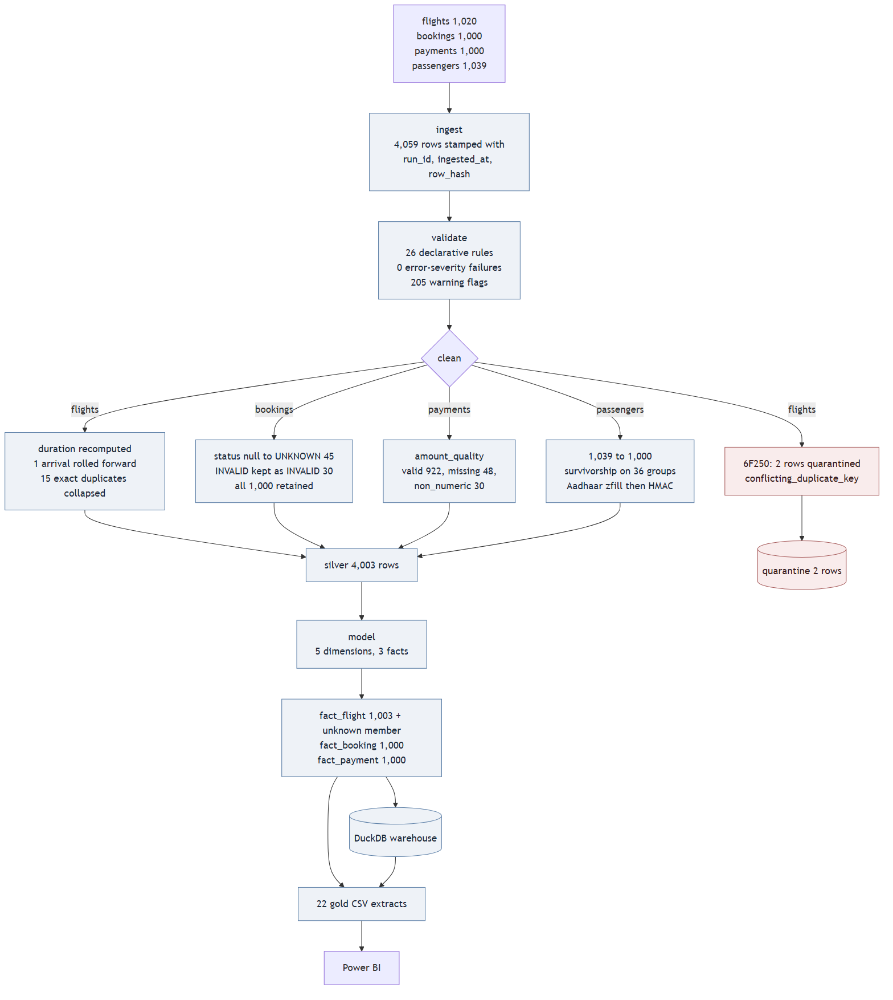

# ASG Airlines data platform

Takes a four-sheet airline workbook with known quality defects and produces a governed star
schema, a DuckDB warehouse, PII-safe CSV extracts and a Power BI model. The pipeline is a
layered medallion build (bronze, silver, gold) with a declarative validation rule set, a
quarantine path for rows that cannot be arbitrated, and keyed tokenisation of every direct
identifier.

## Running it

```bash
python -m venv .venv && source .venv/Scripts/activate   # Windows; use bin/activate on Unix
pip install -r requirements.txt
cp .env.example .env                                    # set ASG_PII_PEPPER
# put the workbook at data/raw/UseCase_Airlines.xlsx
python -m src.pipeline
pytest -q
```

`python -m src.pipeline --dry-run` validates config and prints the stage plan.
`python -m src.pipeline --stage clean` runs one stage, loading its inputs from the layer on
disk. Re-running is safe: layers are overwritten by `run_id` and the outputs are byte-identical
for identical input.

## Architecture

```
Excel (4 sheets, 4,059 rows)
  -> ingest    bronze/  parquet, raw values preserved + run_id, ingested_at, source_sheet, row_hash
  -> validate           26 declarative rules from config/validation_rules.yaml
  -> clean     silver/  typed, corrected, deduplicated, tokenised
               quarantine/  rows that cannot be arbitrated, with the rule that rejected them
  -> model     gold/    star schema, 5 dimensions and 3 facts
  -> kpi                KPI views materialised in DuckDB
  -> export             22 CSV extracts for Power BI + data quality report
```





Single node, deliberately. 4,059 rows is not a distributed problem; Spark's cluster start-up
costs more than the entire transform. The stage boundaries in `src/pipeline.py` map one to one
onto Databricks notebooks or ADF activities, so moving to Spark is a change of executor rather
than a rewrite. The threshold is roughly the point where the flight table stops fitting in
memory, or where ingestion becomes continuous rather than batch.

## Data model



Three facts, three grains: one row per surviving flight, per booking, per payment.
`fact_payment` joins to `fact_booking` and never to `fact_flight`. Joining bookings out to
flights and payments in one query returns 1,404 rows from 1,000 bookings and sums to
7,593,758.92 against a true total of 7,385,142.98 - an inflation of 208,615.94 (2.82%), caused
by 16 duplicated flight ids and 637 bookings carrying 1,000 payments. Keeping each fact at its
own grain is what prevents it.

`dim_date` spans 2025-04-01 to 2026-05-31 because bookings cover twelve months while flights
cover four days. In Power BI it takes an active relationship to `fact_booking[booking_date_key]`
and an inactive one to `fact_flight[departure_date_key]`, activated per measure with
`USERELATIONSHIP`.

## Results

| | |
|---|---|
| Rows ingested | 4,059 |
| Rows in silver | 4,003 |
| Rows quarantined | 2 |
| Flights modelled | 1,003 |
| Bookings modelled | 1,000 |
| Passengers modelled | 1,000 |
| Average duration | 164.67 min (sigma 77.39) |
| Gross revenue | 7,385,142.98 |
| Confirmed revenue | 2,471,402.04 |
| Cancellation rate | 31.40% |
| Payment coverage | 63.70% |



Findings that drove the design:

- **SJ192** is the only flight whose arrival precedes its departure (-1,140 minutes). Rolling
  the arrival forward one day gives exactly 300 minutes, which is exactly what the source
  `duration` column already holds for that row. Two independent sources agree, so the fix is a
  reconciliation rather than a guess.
- **`duration` is a mixed-type column**: 1,019 `datetime.time` values and one
  `datetime.datetime(1899, 12, 29, 5, 0)`, Excel's negative-time artefact, which
  `pd.to_timedelta` refuses.
- **`payments.amount` holds three Python types**, including 30 rows of the literal string
  `"INVALID"` alongside 48 true nulls. `to_numeric(errors="coerce")` collapses two different
  upstream failures into one, so they are classified separately and neither is filled with zero.
- **Aadhaar lost its leading zeros** to int64 storage: 109 values are 11 digits and 5 are 10.
  Hashing before zero-padding would give one person two surrogate keys.
- **All 36 duplicated passenger ids conflict**, and none is a byte-identical row, so
  `drop_duplicates()` would pick an arbitrary survivor. Flights are the opposite case: 15 of 16
  duplicate ids are byte-identical and collapse safely, and only `6F250` conflicts. Same
  symptom, two different correct treatments.
- **Delay is not computable.** There is no scheduled-versus-actual timestamp pair, so an
  anomaly taxonomy with per-table rates is reported instead of an invented on-time figure.
  `scheduled_departure` and `actual_departure` are the two columns that would be needed.

## Layout

```
config/     pipeline.yaml, validation_rules.yaml
src/        ingest, validate, clean, pii, model, kpi, pipeline
sql/        dimension and fact DDL with declared keys, KPI views
tests/      clean, pii, model, no-PII-leak scan
notebooks/  executed walkthrough
data/gold/  CSV extracts consumed by Power BI
reports/    profile, data quality report, run manifest, survivorship log, logs
powerbi/    measures.dax, BUILD_GUIDE.md
docs/       assumptions, security, diagrams, generated documentation
azure/      cloud deployment scripts
```

`data/raw`, `data/bronze`, `data/silver`, `warehouse/` and `.env` are not committed. Gold,
quarantine and reports are, because they carry no raw identifiers and a reviewer should be able
to read the outputs without running anything.
